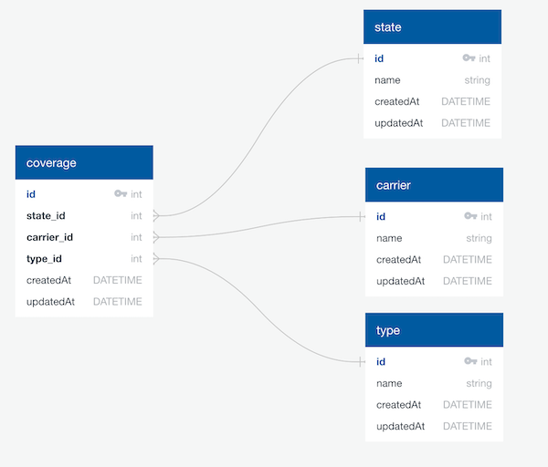

Insurance Coverage Search API
-----------

### About
I built the API using Node, Typescript, Apollo GraphQL and Sequelize. 

The project uses a boilerplate of my own making, one that reflects some of my preferences, interests and opinions. Though
I thought this was useful for this exercise, for a real world app in a business environment I'd more likely just
use an off-the-shelf starter kit like create-react-app, etc. 
 
The project uses the Parcel build tool rather than the more popular Webpack only because Parcel prefers convention 
over configuration whereas Webpack tends towards byzantine configs. Everything is written in Typescript, including
tests, and I use ts-node-dev to run the app and support hot module reloading during development. All dev changes are 
compiled and type checked as they happen. Additionally the app uses husky to run test, eslint and prettier on commit. 

I did resort to some TS `any` casts around Sequelize interfaces as those can take a bit of time to hammer out. For 
a real world app I'd sort those out.  

As far as the architecture is concerned, I guess the meat of it is the data model I chose. It's pretty basic and
minimally normalized such that it would be flexible enough for some future use cases while still being simple enough
to use for the present use case. 



The search implementation is in [graphql.ts](src/server/graphql.ts), it uses simple SQL equals conditions. I chose
this assuming the inputs are known and fixed and not free form inputs requiring fuzziness. 

The API is permissive when it comes to inputs. You can send both, one or none. Sending no inputs will return 
the entire list of coverage combinations. For a production app with a large dataset, I'd probably either require
an input or at the very least paginate the results.   

The entirety of the GraphQL schema for the search API looks like this:

```
type Coverage {
  state: String!
  type: String!
  carrier: String!
}

input CoverageI {
  state: String
  type: String
}

type Query {
  coverage(params: CoverageI): [Coverage]
}
```

The app runs against an SQLite db that lives in `.data/db/db.sqlite`. The db is created and seeded when 
you first start the app using migrations that live in `data/db/migrations/seed.ts`. If you want to add to the 
migrations and re-seed, simply delete `.data/db/db.sqlite` and restart. 


Running
-----------

### pre-requisites
* `node` 
* `yarn` or `npm `

### install and start
* `yarn` or `npm install`
* `yarn start` or `npm start` 
* `yarn test` or `npm test`

### execute a search
* go to the GraphQL playground at `http://localhost:3000/graphql`
* run a query like so:

```
{  
  coverage(params: { state: "IL" }){
    state
    type
    carrier
  }
}
```

and you'll get a result like so:
```
{
  "data": {
    "coverage": [
      {
        "state": "IL",
        "type": "Fire",
        "carrier": "Allstate"
      },
      {
        "state": "IL",
        "type": "Auto",
        "carrier": "Allstate"
      }
    ]
  }
}
```


